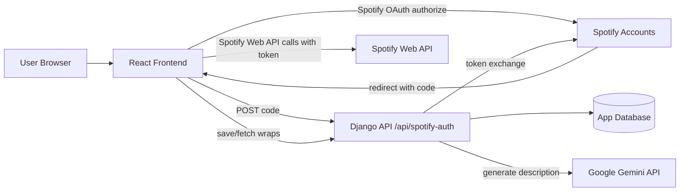

# Spotify Wrapped (Unofficial)

A full-stack app that lets Spotify users generate and share a personal “wrapped” snapshot of their listening habits (top artists, songs, genres, albums, recent listens, and more).


> [!IMPORTANT]
> **Security notice:** this repository history has included environment/config files with sensitive values. Treat any previously committed credentials as compromised: rotate/revoke Spotify, Gemini, database, and Django secrets immediately. Use your own local `.env` files (git-ignored) with placeholder-based configuration.

## Overview

Spotify Wrapped (unofficial) combines:
- A React frontend (Create React App) for Spotify login, browsing results, and sharing public wrap pages.
- A Django backend API for Spotify token exchange, wrap persistence, visibility controls, and AI-generated music-personality descriptions.

This project is currently oriented toward **local development**.

## Features

- Spotify OAuth login flow
- Profile + listening insights pages:
  - Top artists
  - Top songs
  - Top genres
  - Top albums
  - Fun fact
  - Recently played tracks
  - Saved shows
- Save wraps and control wrap visibility (public/private)
- Public wrap gallery and shareable public wrap page (`/wrap/:wrapId`)
- AI-generated personality description from listening taste (Google Gemini)
- Supporting pages: callback, thank-you, about

## How it works



## Tech stack

### Frontend
- React 18 (Create React App)
- React Router
- Axios
- styled-components
- Tailwind CSS

### Backend
- Django 4.2
- Django REST Framework
- django-cors-headers
- django-environ
- Requests
- Google Generative AI client

### Data/API
- Spotify OAuth + Spotify Web API
- Django model-backed wrap storage
- Gemini text generation for music personality output

## Project structure

```text
spotifywrapped/
├── src/                     # React app
│   ├── App.js               # Route definitions
│   ├── LandingPage.js
│   ├── SpotifyCallback.js
│   ├── ProfilePage.js
│   ├── TopArtists.js / TopSongs.js / TopGenres.js / TopAlbums.js
│   ├── FunFact.js / RecentlyPlayedTracks.js / SavedShows.js
│   ├── PublicWrappedPage.js / ThankYou.js / AboutUs.js
│   └── config.js            # Spotify auth URL + scopes
├── backend/
│   ├── manage.py
│   ├── backend/             # Django project settings/urls
│   ├── api/                 # API views, urls, models
│   └── db.sqlite3           # SQLite file present in repo
├── package.json
└── README.md
```

## Prerequisites

- Node.js 18+ and npm
- Python 3.10+ (3.11+ recommended)
- A Spotify Developer app
- A Google Gemini API key (for description generation endpoint)
- PostgreSQL (if using current backend database settings as-is)

## Configuration

### 1) Frontend Spotify OAuth settings

Frontend auth settings are currently defined in `src/config.js`, including:
- Spotify client ID
- Redirect URI (`http://localhost:3000/callback` in current local setup)
- Scopes:
  - `user-read-private`
  - `user-read-email`
  - `user-library-read`
  - `user-read-recently-played`
  - `user-top-read`

Your Spotify app configuration in the Spotify Developer Dashboard **must include the exact same redirect URI** used by the app.

### 2) Backend environment variables

Create your own local file at `backend/.env` (do not commit it):

```env
SPOTIFY_CLIENT_ID=your_spotify_client_id
SPOTIFY_CLIENT_SECRET=your_spotify_client_secret
SPOTIFY_REDIRECT_URI=http://localhost:3000/callback
GEMINI_API_KEY=your_gemini_api_key
# Optional/additional values depending on local backend settings
# DJANGO_SECRET_KEY=replace_for_local_dev
# DB_NAME=...
# DB_USER=...
# DB_PASSWORD=...
# DB_HOST=...
# DB_PORT=...
```

## Running locally

> Use two terminals: one for backend, one for frontend.

### Terminal A — backend (Django)

```bash
cd /home/runner/work/spotifywrapped/spotifywrapped/backend
python -m venv .venv
source .venv/bin/activate
pip install --upgrade pip
```

No `requirements.txt` (or other pinned dependency file) is currently committed, so install dependencies based on imports/settings:

```bash
pip install "django>=4.2,<5" djangorestframework django-cors-headers django-environ requests google-generativeai psycopg2-binary
```

Run migrations and start the server:

```bash
python manage.py migrate
python manage.py runserver 127.0.0.1:8000
```

### Terminal B — frontend (React)

```bash
cd /home/runner/work/spotifywrapped/spotifywrapped
npm install
npm start
```

App URL: `http://localhost:3000`

## Available scripts

From repository root (`/home/runner/work/spotifywrapped/spotifywrapped`):

- `npm start` — run frontend in development mode
- `npm run build` — production build output in `build/`
- `npm test` — run frontend tests via react-scripts
- `npm run eject` — eject CRA config (irreversible)

## API endpoint overview

Backend project URLs include `path('api/', include('api.urls'))`, so routes below are typically prefixed with `/api`.

| Method | Endpoint (api app route) | Purpose |
|---|---|---|
| POST | `/spotify-auth` | Exchange Spotify authorization code for token data |
| POST | `/save-wrapped` | Save wrap data or update visibility when wrap already exists |
| GET | `/get-public-wraps` | Return wraps marked public |
| GET | `/get-wrap/<wrapId>/` | Return one wrap by Spotify user ID |
| POST | `/get-description` | Generate a Gemini-based music personality description |
| GET | `/get-user-wraps/<display_name>/` | List wraps for a display name |
| DELETE | `/delete-wrap/<wrap_id>` | Delete a single wrap by internal ID |
| POST | `/update-wrap-visibility/<wrap_id>` | Change public/private visibility |
| DELETE | `/delete-wraps/<display_name>/` | Delete all wraps for a display name |

Example full local URL: `http://127.0.0.1:8000/api/get-public-wraps`

## Testing & building

Frontend:

```bash
npm test
npm run build
```

Backend (if/when backend tests are implemented/updated):

```bash
cd /home/runner/work/spotifywrapped/spotifywrapped/backend
python manage.py test
```

## Privacy & security considerations

- Do **not** commit `.env` files or live credentials.
- Rotate/revoke any credentials that may already have been committed in repository history.
- Users must provide their own Spotify and Gemini credentials.
- Current backend views include CSRF-exempt endpoints intended for local/dev workflows; review and harden before any real deployment.

## Troubleshooting

- **Spotify login redirects fail:** ensure frontend redirect URI and Spotify Dashboard redirect URI match exactly.
- **Token exchange errors at `/api/spotify-auth`:** verify backend `.env` values (`SPOTIFY_CLIENT_ID`, `SPOTIFY_CLIENT_SECRET`, `SPOTIFY_REDIRECT_URI`).
- **CORS errors from frontend to backend:** backend currently allows `http://localhost:3000`; update CORS settings if using another origin.
- **Database connection issues:** backend settings currently target PostgreSQL locally; ensure your DB is running/configured or adjust settings for your local environment.
- **Gemini description errors:** verify `GEMINI_API_KEY` is valid and available to Django runtime.

## Contributing

Contributions are welcome. A safe workflow:

1. Fork and create a feature branch
2. Make focused changes
3. Run frontend tests/build locally
4. Open a pull request with context and screenshots/API notes when relevant

## License / project status

- **License:** No license file is currently present in this repository.
- **Status:** Active local-development project; no verified production deployment URL is documented.
